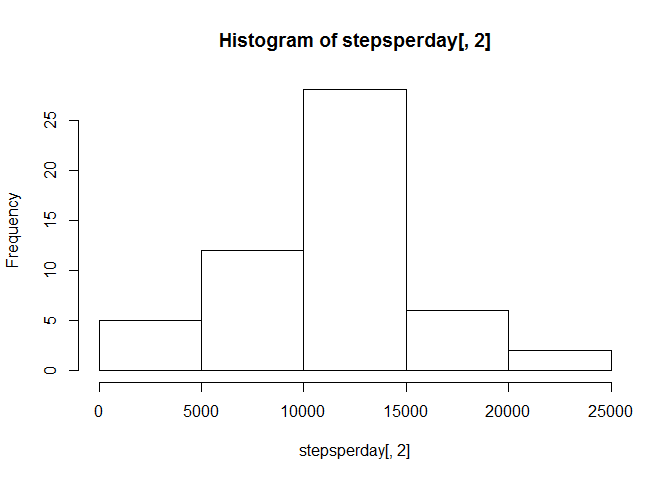
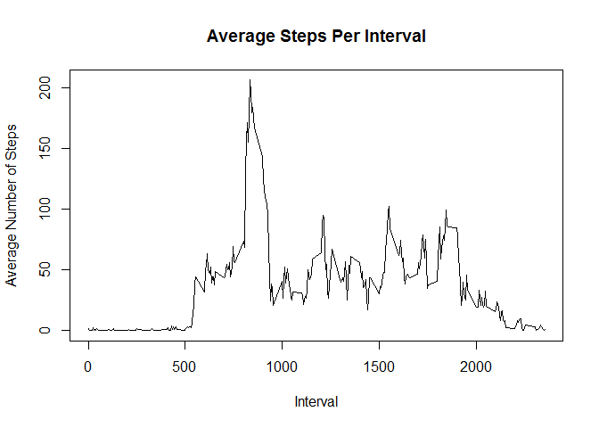
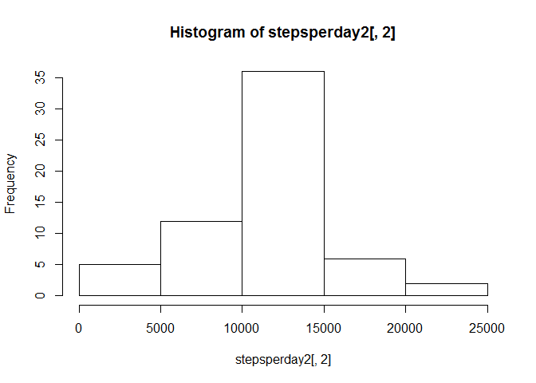
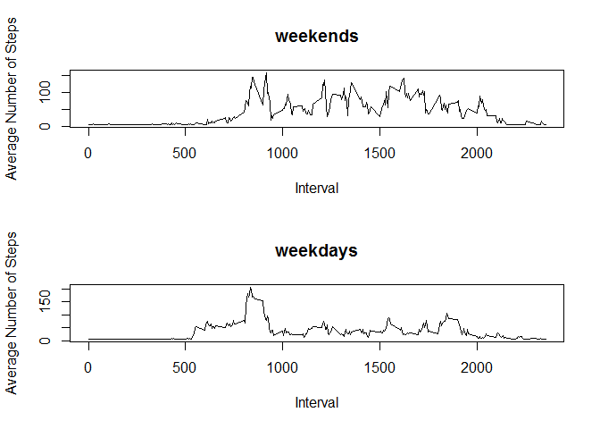

# Reproducible Research: Peer Assessment 1


## Loading and preprocessing the data

###1. Load the data

First, we load and view the dataset:


```r
stepsdata <- read.csv("C:/Users/user/Google Drive/Education/Data Science/Reproducible/Project1/RepData_PeerAssessment1/activity.csv")                    
head(stepsdata)
```

```
##   steps       date interval
## 1    NA 2012-10-01        0
## 2    NA 2012-10-01        5
## 3    NA 2012-10-01       10
## 4    NA 2012-10-01       15
## 5    NA 2012-10-01       20
## 6    NA 2012-10-01       25
```

###2. Process/transform the data (if necessary) into a format suitable for your analysis  

First, we check the data type in columns:


```r
class(stepsdata[,1])
```

```
## [1] "integer"
```

```r
class(stepsdata[,2])
```

```
## [1] "factor"
```

```r
class(stepsdata[,3])
```

```
## [1] "integer"
```

It looks like all data types are numeric. So we converting the date column to date data type:


```r
stepsdata[,2] <- as.Date(stepsdata[,2])
```

## What is mean total number of steps taken per day?

###1. Calculate the total number of steps taken per day

First, for simplicity and later reuse of the main dataset, we create a new data frame consisting of two columns (one for dates and one for steps):


```r
dayandsteps <- data.frame(day = stepsdata$date, steps = stepsdata$steps)
```

Then we sum up all steps and for each particular day. We store the results in a new data frame: 


```r
stepsperday <- aggregate(. ~ day, data=dayandsteps, FUN=sum)
```

####2. Make a histogram of the total number of steps taken each day

We build the histogram from the newly created data frame: 


```r
hist(stepsperday[,2])
```

 

###3. Calculate and report the mean and median of the total number of steps taken per day

First, we calculate the mean and the median from the new data frame: 


```r
meansteps <- mean(stepsperday[,2])
mediansteps <- median(stepsperday[,2])
```

Then we output the values of the mean and the median:  


```r
print(paste("Mean steps per day: ",meansteps))
```

```
## [1] "Mean steps per day:  10766.1886792453"
```

```r
print(paste("Median steps per day: ",mediansteps))
```

```
## [1] "Median steps per day:  10765"
```

## What is the average daily activity pattern?

###1. Make a time series plot (i.e. type = "l") of the 5-minute interval (x-axis) and the average number of steps taken, averaged across all days (y-axis)

First, we create a new data frame consisting of intervals and steps only: 


```r
intervalsteps <- data.frame(interval = stepsdata$interval, steps =stepsdata$steps)
```

Second, we calculate the mean number of steps for each interval: 


```r
averagestepsperinterval <- aggregate(. ~ interval, data=intervalsteps, FUN=mean)
```

Third, we plot this data using the plot function and adding labels for clarity:


```r
plot(averagestepsperinterval[,1], averagestepsperinterval[,2], type = "l", main = "Average Steps Per Interval", xlab = "Interval", ylab = "Average Number of Steps")
```

 

###2. Which 5-minute interval, on average across all the days in the dataset, contains the maximum number of steps?

First, we find the position of the greatest number within the data frame and the value at this position: 


```r
maxperinterval <- max(averagestepsperinterval[,2])
position_max <- which(averagestepsperinterval[,2] == maxperinterval)
interval_with_max <- averagestepsperinterval[position_max,1]
```

Then we ouput this largest value: 


```r
print(paste("Interval with maximum number of steps: ",interval_with_max))
```

```
## [1] "Interval with maximum number of steps:  835"
```

## Imputing missing values

###1. Calculate and report the total number of missing values in the dataset (i.e. the total number of rows with NAs)

First, we find the positions of missing values in the originally loaded data set: 


```r
missingpositions <- which(is.na(stepsdata[,1]))
```

Then we calculate the total number of missing values and output the result: 


```r
numberofmissing <- length(missingpositions)
print(paste("Number of mission values: ",numberofmissing))
```

```
## [1] "Number of mission values:  2304"
```

###2. Devise a strategy for filling in all of the missing values in the dataset

First, we calculate the mean number of steps per interval and output this value: 


```r
meanstepsperday <- aggregate(. ~ day, data=dayandsteps, FUN=mean)
meanstepsperday$day <- as.character(meanstepsperday$day)
averageint <- mean(averagestepsperinterval[,2])
averageint
```

```
## [1] 37.3826
```

Second, we replace missing interval values with this avergae value of steps per interval computed earlier. We find missing days manualy to insure data quality:


```r
newrow1 <- c("2012-10-01", 37.3826)
newrow2 <- c("2012-10-08", 37.3826)
newrow3 <- c("2012-11-01", 37.3826)
newrow4 <- c("2012-11-04", 37.3826)
newrow5 <- c("2012-11-09", 37.3826)
newrow6 <- c("2012-11-10", 37.3826)
newrow7 <- c("2012-11-14", 37.3826)
newrow8 <- c("2012-11-30", 37.3826)
```

Then we append all these missing values to the dataset storing averages for each day, just in case:


```r
completemeanstepsperday <- rbind(newrow1,newrow2,newrow3,newrow4,newrow5,newrow6,newrow7,newrow8,meanstepsperday)
#Convert NAs into mean values per that day of 2012-10-01, we replace it with overall mean per interval:
completemeanstepsperday$day <- as.Date(completemeanstepsperday$day)
completemeanstepsperday$steps <- as.numeric(completemeanstepsperday$steps)
```

Then we go through the original dataset and replace missing interval values with the average number of steps per interval earlier: 


```r
for (i in 1:17568) {
  if(is.na(stepsdata[i,1])) {
    #missday <- stepsdata[i,2]
    #dayposition <- which(completemeanstepsperday$day == missday)
    stepsdata[i,1] <- averageint
      }
  }
```

###3. Create a new dataset that is equal to the original dataset but with the missing data filled in.

We write the new data set into a file:


```r
write.csv(stepsdata, file = "newdataset.csv")
```

###4.Make a histogram of the total number of steps taken each day and Calculate and report the mean and median to1tal number of steps taken per day. Do these values differ from the estimates from the first part of the assignment? What is the impact of imputing missing data on the estimates of the total daily number of steps?

First, we create a new data frame for building a histogram:


```r
dayandsteps2 <- data.frame(day = stepsdata$date, steps = stepsdata$steps)
```

Then we aggregate totals for each day: 


```r
stepsperday2 <- aggregate(. ~ day, data=dayandsteps2, FUN=sum)
```

After that, we build the histogram: 


```r
hist(stepsperday2[,2])
```

 

And calculate and print the averages: 


```r
meansteps2 <- mean(stepsperday2[,2])
mediansteps2 <- median(stepsperday2[,2])
print(paste("Mean steps per day: ",meansteps2))
```

```
## [1] "Mean steps per day:  10766.1886792453"
```

```r
print(paste("Median steps per day: ",mediansteps2))
```

```
## [1] "Median steps per day:  10766.1886792453"
```

It is clear that by replacing the missing value with averages we made the data more clustered. The data is more normal - mean almost equals the median. Moreover, there's a higher kurtosis, which means that more values are closer to the mean now.


## Are there differences in activity patterns between weekdays and weekends?

###1. Create a new factor variable in the dataset with two levels – “weekday” and “weekend” indicating whether a given date is a weekday or weekend day.

First, we locate weekends and weekdays in the original data frame: 


```r
weekendposition <- which((weekdays(stepsdata$date) == "Saturday")|(weekdays(stepsdata$date) == "Sunday"))
weekdayposition <- which(!(weekdays(stepsdata$date) == "Saturday")&!(weekdays(stepsdata$date) == "Sunday"))
```

Then we create a new column vector: 


```r
addcolumn <- c(1:17568)
addcolumn[weekendposition] <- "Weekend"
addcolumn[weekdayposition] <- "Weekday"
```

And we append the new vector column as a new column to the original data frame: 


```r
newstepsdata <- cbind(stepsdata,daytype= addcolumn)
```

###2. Make a panel plot containing a time series plot (i.e. type = "l") of the 5-minute interval (x-axis) and #the average number of steps taken, averaged across all weekday days or weekend days (y-axis).

First, we create two new datasets for plotting based on the factor variable


```r
weekdaysdata <- data.frame(steps = newstepsdata$steps[weekdayposition],date = newstepsdata$date[weekdayposition], interval = newstepsdata$interval[weekdayposition])
weekendsdata <- data.frame(steps = newstepsdata$steps[weekendposition],date = newstepsdata$date[weekendposition], interval = newstepsdata$interval[weekendposition])
```

Then we create data frames with average steps per interval:


```r
intervalsteps1 <- data.frame(interval = weekdaysdata$interval, steps =weekdaysdata$steps)
averagestepsperinterval1 <- aggregate(. ~ interval, data=intervalsteps1, FUN=mean)
intervalsteps2 <- data.frame(interval = weekendsdata$interval, steps =weekendsdata$steps)
averagestepsperinterval2 <- aggregate(. ~ interval, data=intervalsteps2, FUN=mean)
```

Then we create these two plots in a two-facet panel 


```r
par(mfcol=c(2,1))
plot(averagestepsperinterval2[,1], averagestepsperinterval2[,2], type = "l", main = "weekends", xlab = "Interval", ylab = "Average Number of Steps")
plot(averagestepsperinterval1[,1], averagestepsperinterval1[,2], type = "l", main = "weekdays", xlab = "Interval", ylab = "Average Number of Steps")
```

 

An interresting observation emerges from side-by-side comparison of these graps. It looks like during weekdays the number of steps is high only in the morning (between 5am and 9am, with peak being around 8am-9am). This is when people are excercising or simply walking to work. Then, after 10am the level of activity drops. This means that people are sitting in the office, without making much movment. There's a small spike at around 7pm - this is probably when people are returning from work or exercising. 

During weekends there's still a moderate spike in activity in the morning (somewhere between 8am and 9am). This means people are still excercising in the morning. Then there's a moderate level of acitvity throughout the day. This means that people are quite active over the weekend. Also, there's a slight prolongation of acitivty well beyond 8pm with a spike at around 8pm. This can be an indication of people's night life. 
